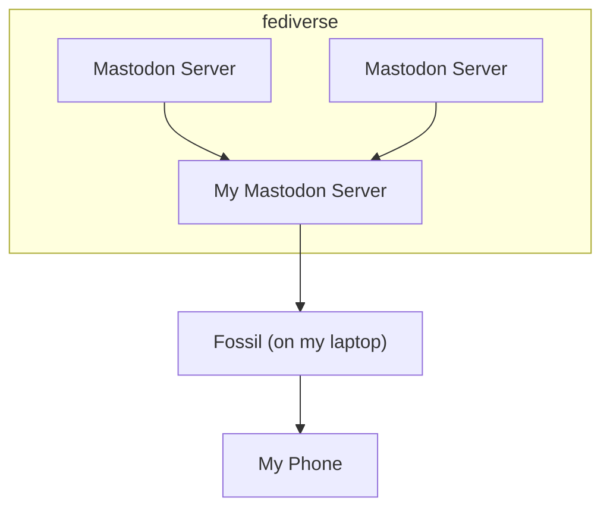
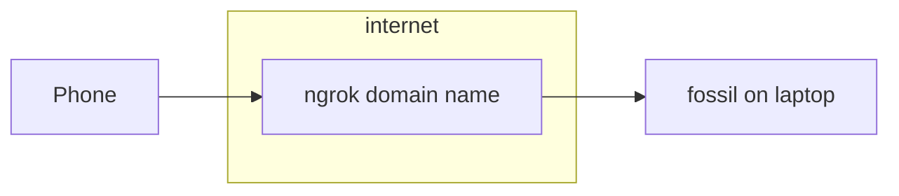
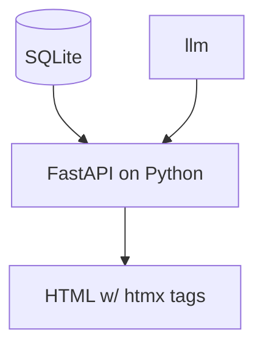

# It's a *Client*

Fossil is a Mastodon **client**. While there is a web server that keeps state, it only downloads your home timeline and redisplays it. It doesn't touch posts from accounts or hashtags that you don't follow.

## How Do I Connect My Phone?

Traditionally, the way you'd do this would be to deploy fossil into a cloud environment. The problem is that, if it's running on my laptop it doesn't have a public IP address, so by deploying it in the cloud 
I can leverage infrastructure in AWS or Azure to serve it with a public IP address and/or a full domain name.

### Option 1: Tailscale
[Tailscale](https://tailscale.com/kb/1017/install?slug=kb&slug=1017&slug=install) sets up a mesh network. It's similar to a corporate VPN, except that it's so easy to install that you can trivially pop it
onto your phone, laptop, home lab, cloud lab, IoT devices, etc.

The setup is:

1. Follow tailscale's directions
2. Install tailscale on your laptop
3. Install tailscale on your phone
4. Run fossil on your laptop, remember the port
5. Lookup your laptop's hostname
6. Open up safari/chrome/firefox/etc. and paste in the hostname and port: `http://{hostname}:{port}`

This works seamlessly for yourself and potentially sharing with a small number of friends and family.

### Option 2: ngrok
[Ngrok](https://ngrok.com/docs/getting-started/) works a bit different from tailscale. It gives you a public domain name to reach your app, and then tunnels traffic through to your laptop

This works better if you want to share it with a lot of people. You can easily tack on authentication, like OAuth.

# Code Architecture
It's a fairly standard htmx-on-python arrangement

SQLite stores:
- Toots
  - `id`: This is an internal auto-incrementing ID. Not the same as `toot_id`
  - Some other fields parsed from JSON
  - `embedding`: The embedding vector, stored as a BLOB. In memory it's kept as a numpy array.
  - `orig_json`: The full unaltered JSON that the mastodon server sent us, stored as TEXT
- Session
  - `id`: The session ID. This is stored in an HTTP cookie when sent to the browser, so all requests can correspond to a session.
  - `algorithm_spec`: A JSON object (stored as TEXT) describing the module & class name of the algorithm currently in use.
  - `algorithm`: The algorithm serialized via [pickle](https://docs.python.org/3/library/pickle.html), stored as a BLOB. This enables
    pluggable algorithms to keep their own state persistently.

HTTP Cookies
- `fossil_session_id`: The primary key of the `sessions` table. Created whenever it's empty, never expires.

## Code Layout

- `core.py`: Database access, downloading toots, etc.
- `config.py`: Configuration & wrappers around configuration mechanisms. All config should have either a constant or simple function.
- [DEPRECATED] `science.py`: Functionality here has been moved to `algorithm/topic_cluster.py` and made more pluggable.
- `server.py`: Entry point. FastAPI app with all core HTTP operations defined. Operations return either a jinja template or a literal HTML response.
- `ui.py`: partially deprecated (it contains old streamlit code).
- `algorithm/`
  - `base.py`: Base classes and utilities needed for building algorithm plugins. All algorithms are installed as plugins, even standard ones.
  - Remaining files: algorithms, each implementing base classes from `base.py`.
- `app/`
  - `static/`: various CSS & JavaScript files
    - `style.css`: the only CSS we're writing manually
    - `page.js`: The only JS we're writing manually. No pre or post processing pipeline, it's downloaded literally as it's stored in Git, comments and all.
    - Other files: Things I downloaded
  - `templates/`: Jinja templates
    - `index.html`: Returned by `GET /`
    - `settings.html`: Returned by `GET /settings`
    - `toot*.html`: Different sub-templates included into `index.html` or returned from XHR endpoints. You can use these for building plugins.
    - `base/`
      - `page.html`: Base template that is inherited by both `index.html` and `settings.html`
     

# Plugin Architecture
## Making an Algorithm Plugin
An algorithm plugin involves:

1. Algorithm class
2. [Optional] Renderer class
3. [Optional] Jinja templates for displaying

All algorithms are plugins, so you can use [`topic_cluster.py`](https://github.com/tkellogg/fossil/blob/main/fossil_mastodon/algorithm/topic_cluster.py)
as a guide.

### Algorithm Class
Use `base.BaseAlgorithm` as a base class, implement these methods:

- `render(toots, render_context)`: Convert a list of toots into a Renderer object (which converts to an HTTP response)
- `train(toots, train_context, args)`: Produces an instance of your algorithm class. The assumption is that you're training
  some sort of model, e.g. topic_cluster trains a sklearn `KMeansCluster` model and stores it in a field of the `TopicCluster`
  object. By storing it in a field, it ensures that the algorithm is serialized to and from the database.

### [Optional] Renderer Class
You might not need to do this if you can find a different template & renderer that works for you. This should be very easy to implement, it's just a 
matter of capturing the data you need and then passing it to a template.

Use `base.Renderable` as a base class, implement these methods:

- `render()`: Returns a FastAPI response. Typically you're going to return a TemplateResponse

